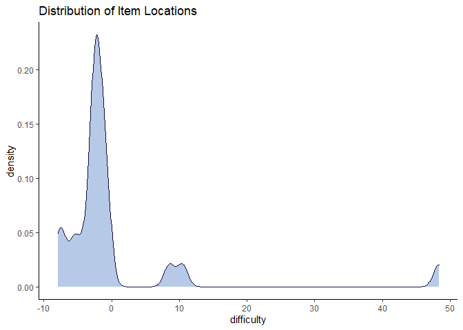
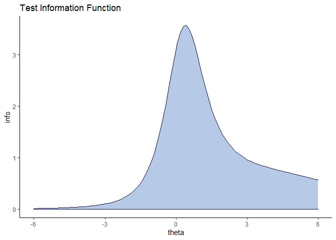
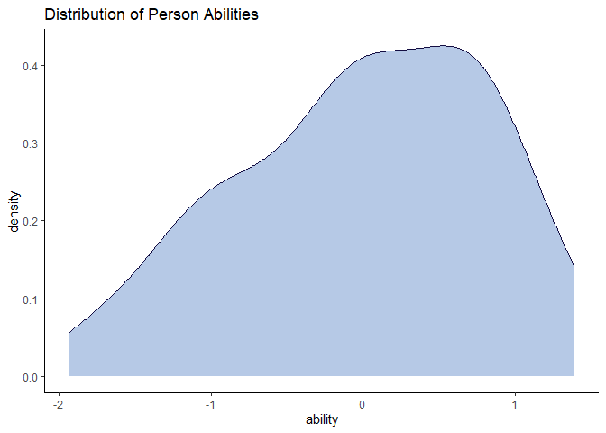
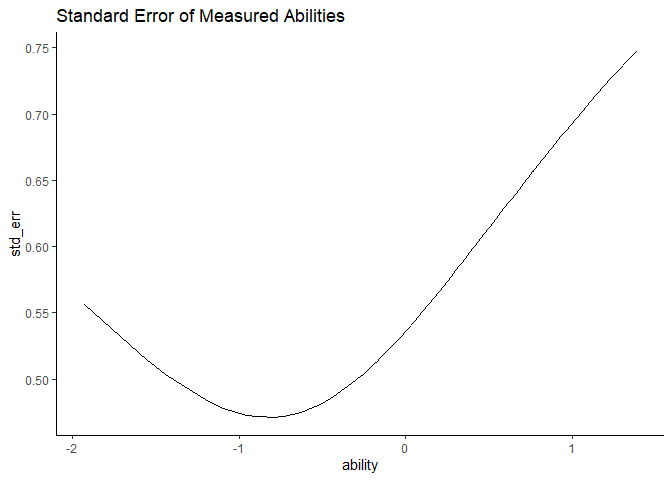
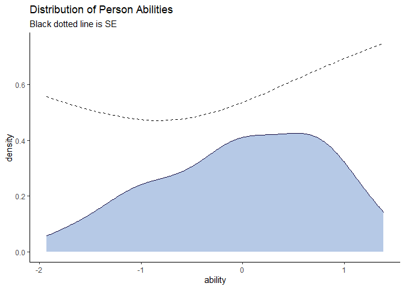

The wizirt package is up and running. To install it, use

    devtools::install_github('Pflegermeister/wizirt')

The wizirt package represents the work of my dissertation. As such I
have agreed to do the following for the first round of development. I
will walk through how to do each using the wizirt package. Data for
testing the package can be loaded using

    library(wizirt)
    data('responses')

-   Two levels of accessibility
    -   Comprehensive report for beginners I didn’t run this here
        because it creates a new Rmarkdown.

<!-- -->

    irt_summarize(responses[,-1], 
                  title = 'My report', 
                  author = 'Pflegermeister', 
                  note = 'This is a note', 
                  item_type = '2PL') # xxxx

-   Felxible functions for advanced users

The advanced user interface follows the <code>parsnip</code> package
closely.

    my_model <- irt(item_type = '2PL') %>%  
      set_engine('mirt') %>%
      fit_wizirt(data = responses[,-1])
    # need to add:
    # - ltm: 2PL and 3PL
    # - eRm: Rasch
    # xxxx

A lot of people have commented that they would like to see a wrapper
function for this so they don’t have to specify this on multiple lines.
That will come in the future.

-   Provide general model information including:
    -   Model call
    -   Description of model run
    -   Software and version
    -   Estimator
    -   Convergence status, criteria, values
    -   Estimation issues (Warnings printed to console)

<!-- -->

    print(my_model, type = 'tech')

    ## # A tibble: 11 x 2
    ##    parameter      value                                                         
    ##    <chr>          <chr>                                                         
    ##  1 package        "mirt"                                                        
    ##  2 function       "mirt"                                                        
    ##  3 version        "1.32.7"                                                      
    ##  4 call           "mirt::mirt(data = data, model = 1, itemtype = \"2PL\", SE = ~
    ##  5 factors        "1"                                                           
    ##  6 item type      "2PL"                                                         
    ##  7 converged      "TRUE"                                                        
    ##  8 method         "EM"                                                          
    ##  9 log-likelihood "-1009.37643471027"                                           
    ## 10 criteria       "1e-05"                                                       
    ## 11 iterations     "76"

-   Response data described (sample size, demographics)
-   Descriptions of items and test

<!-- -->

    print(my_model, type = 'desc')

    ## # A tibble: 7 x 2
    ##   parameter         value
    ##   <chr>             <dbl>
    ## 1 N Items           25   
    ## 2 Avg Difficulty    -0.06
    ## 3 Avg Diff (CTT)     0.75
    ## 4 N Persons         75   
    ## 5 Avg Ability        0   
    ## 6 Avg % Correct     75   
    ## 7 Avg % Completion 100

-   Missing data summary

<!-- -->

    print(my_model, type = 'na_item')

    ## # A tibble: 25 x 3
    ##    item  count  prop
    ##    <chr> <dbl> <dbl>
    ##  1 A         0     0
    ##  2 B         0     0
    ##  3 C         0     0
    ##  4 D         0     0
    ##  5 E         0     0
    ##  6 F         0     0
    ##  7 G         0     0
    ##  8 H         0     0
    ##  9 I         0     0
    ## 10 J         0     0
    ## # ... with 15 more rows

    print(my_model, type = 'na_person')

    ## # A tibble: 75 x 3
    ##    person count  prop
    ##     <int> <dbl> <dbl>
    ##  1      1     0     0
    ##  2      2     0     0
    ##  3      3     0     0
    ##  4      4     0     0
    ##  5      5     0     0
    ##  6      6     0     0
    ##  7      7     0     0
    ##  8      8     0     0
    ##  9      9     0     0
    ## 10     10     0     0
    ## # ... with 65 more rows

-   Description of missing data handling

Generally, missing data are handled using full information during
estimation. Additional functions for item and person fit tend to use
list wise deletion or pairwise information when possible. Currently only
supports unidimensional, parametric, dichotomous models. Better detail
in documentation forthcoming.

-   Provide model fit information

<!-- -->

    assumptions <- irt_assume(my_model)
    print(assumptions)

    ## # A tibble: 12 x 2
    ##    pars                  value
    ##    <chr>                 <dbl>
    ##  1 DETECT                -0.22
    ##  2 ASSI                  -0.17
    ##  3 RATIO                 -0.14
    ##  4 MADCOV100              1.59
    ##  5 MCOV100               -0.22
    ##  6 log_lik            -1009.  
    ##  7 AIC                 2069.  
    ##  8 AICc                2095.  
    ##  9 BIC                 2127.  
    ## 10 SABIC               2048.  
    ## 11 HQ                  2092.  
    ## 12 Num LD pairs < .05    23

-   Unidimensionality (DETECT)

<!-- -->

    assumptions$unidim

    ## # A tibble: 5 x 2
    ##   stat      value
    ##   <chr>     <dbl>
    ## 1 DETECT    -0.22
    ## 2 ASSI      -0.17
    ## 3 RATIO     -0.14
    ## 4 MADCOV100  1.59
    ## 5 MCOV100   -0.22

    print(assumptions, type = 'unid')

    ## # A tibble: 5 x 2
    ##   stat      value
    ##   <chr>     <dbl>
    ## 1 DETECT    -0.22
    ## 2 ASSI      -0.17
    ## 3 RATIO     -0.14
    ## 4 MADCOV100  1.59
    ## 5 MCOV100   -0.22

-   Absolute fit

<!-- -->

    # not yet implemented xxxx # I am thinking of approximate fit from http://www.ub.edu/gdne/documents/mirp13_focus_article.pdf
    # I need to figure out how to calculate the degrees of freedom they discuss in here. 
    assumptions$abs_fit

    ## NULL

    print(assumptions, type = 'abs')

    ## NULL

-   Relative fit

<!-- -->

    assumptions$rel_fit

    ## # A tibble: 8 x 2
    ##   stat    values
    ##   <chr>    <dbl>
    ## 1 log_lik -1009.
    ## 2 N          75 
    ## 3 n_pars     25 
    ## 4 AIC      2069.
    ## 5 AICc     2095.
    ## 6 BIC      2127.
    ## 7 SABIC    2048.
    ## 8 HQ       2092.

    print(assumptions, type = 'rel')

    ## # A tibble: 8 x 2
    ##   stat    values
    ##   <chr>    <dbl>
    ## 1 log_lik -1009.
    ## 2 N          75 
    ## 3 n_pars     25 
    ## 4 AIC      2069.
    ## 5 AICc     2095.
    ## 6 BIC      2127.
    ## 7 SABIC    2048.
    ## 8 HQ       2092.

-   Anova method for comparing models

<!-- -->

    anova(my_model)

    ## # A tibble: 8 x 2
    ##   stat    values
    ##   <chr>    <dbl>
    ## 1 log_lik -1009.
    ## 2 N          75 
    ## 3 n_pars     25 
    ## 4 AIC      2069.
    ## 5 AICc     2095.
    ## 6 BIC      2127.
    ## 7 SABIC    2048.
    ## 8 HQ       2092.

    model2 <- irt(rownames = ids, item_type = '2PL', irt_pars = T, tol = 1e-5) %>% 
      set_engine('mirt') %>% 
      fit_wizirt(responses[,-1])

    anova(my_model, model2)

    ##        AIC     AICc    SABIC       HQ     BIC    logLik  X2  df   p
    ## 1 2068.753 2095.283 2047.897 2091.887 2126.69 -1009.376 NaN NaN NaN
    ## 2 2068.753 2095.283 2047.897 2091.887 2126.69 -1009.376   0   0   1
    ##                                                                                     call
    ## 1 mirt::mirt(data = data, model = 1, itemtype = "2PL", SE = T, TOL = 1e-05, verbose = F)
    ## 2 mirt::mirt(data = data, model = 1, itemtype = "2PL", SE = T, TOL = 1e-05, verbose = F)

-   Provide item information
    -   Parameter estimates

<!-- -->

    my_model$fit$parameters$coefficients

    ## # A tibble: 25 x 4
    ##    item  difficulty discrimination guessing
    ##    <chr>      <dbl>          <dbl>    <dbl>
    ##  1 A         -0.606         1.75          0
    ##  2 B         -1.87          0.580         0
    ##  3 C         -2.26          0.624         0
    ##  4 D         -2.32          0.363         0
    ##  5 E         10.5          -0.0904        0
    ##  6 F         -5.38          0.177         0
    ##  7 G         -1.71          0.952         0
    ##  8 H         -0.996         1.22          0
    ##  9 I         -2.63          0.459         0
    ## 10 J         -2.70          0.416         0
    ## # ... with 15 more rows

    print(my_model, type ='item')

    ## # A tibble: 25 x 4
    ##    item  difficulty discrimination guessing
    ##    <chr>      <dbl>          <dbl>    <dbl>
    ##  1 A         -0.606         1.75          0
    ##  2 B         -1.87          0.580         0
    ##  3 C         -2.26          0.624         0
    ##  4 D         -2.32          0.363         0
    ##  5 E         10.5          -0.0904        0
    ##  6 F         -5.38          0.177         0
    ##  7 G         -1.71          0.952         0
    ##  8 H         -0.996         1.22          0
    ##  9 I         -2.63          0.459         0
    ## 10 J         -2.70          0.416         0
    ## # ... with 15 more rows

    plot(my_model, type = 'diff')

-   Summary statistics

<!-- -->

    print(my_model, type = 'tech')

    ## # A tibble: 11 x 2
    ##    parameter      value                                                         
    ##    <chr>          <chr>                                                         
    ##  1 package        "mirt"                                                        
    ##  2 function       "mirt"                                                        
    ##  3 version        "1.32.7"                                                      
    ##  4 call           "mirt::mirt(data = data, model = 1, itemtype = \"2PL\", SE = ~
    ##  5 factors        "1"                                                           
    ##  6 item type      "2PL"                                                         
    ##  7 converged      "TRUE"                                                        
    ##  8 method         "EM"                                                          
    ##  9 log-likelihood "-1009.37643471027"                                           
    ## 10 criteria       "1e-05"                                                       
    ## 11 iterations     "76"

    print(my_model, type = 'desc')

    ## # A tibble: 7 x 2
    ##   parameter         value
    ##   <chr>             <dbl>
    ## 1 N Items           25   
    ## 2 Avg Difficulty    -0.06
    ## 3 Avg Diff (CTT)     0.75
    ## 4 N Persons         75   
    ## 5 Avg Ability        0   
    ## 6 Avg % Correct     75   
    ## 7 Avg % Completion 100

    plot(my_model, type = 'tinfo')

    plot(my_model, type = 'theta')

    plot(my_model, type = 'diff')

    plot(my_model, type = 'theta_diff')

-   Provide item-fit information
    -   Conditional dependence

<!-- -->

    # assumptions <- irt_assume(my_model) # already run
    assumptions$ld

    ## # A tibble: 300 x 5
    ##    item_1 item_2    LD    pvals    ccov
    ##    <chr>  <chr>  <dbl>    <dbl>   <dbl>
    ##  1 A      W      0.405 0.000312 -0.0269
    ##  2 J      P      0.399 0.000398  0.0584
    ##  3 K      W      0.363 0.00139  -0.0150
    ##  4 A      S      0.331 0.00371   0.0393
    ##  5 A      K      0.315 0.00592  -0.0154
    ##  6 O      T      0.309 0.00695   0.0472
    ##  7 D      I      0.303 0.00816   0.0461
    ##  8 H      W      0.295 0.0101   -0.0151
    ##  9 M      Q      0.285 0.0132    0.0495
    ## 10 H      P      0.282 0.0142    0.0239
    ## # ... with 290 more rows

    print(assumptions, type = 'ld')

    ## # A tibble: 300 x 5
    ##    item_1 item_2    LD    pvals    ccov
    ##    <chr>  <chr>  <dbl>    <dbl>   <dbl>
    ##  1 A      W      0.405 0.000312 -0.0269
    ##  2 J      P      0.399 0.000398  0.0584
    ##  3 K      W      0.363 0.00139  -0.0150
    ##  4 A      S      0.331 0.00371   0.0393
    ##  5 A      K      0.315 0.00592  -0.0154
    ##  6 O      T      0.309 0.00695   0.0472
    ##  7 D      I      0.303 0.00816   0.0461
    ##  8 H      W      0.295 0.0101   -0.0151
    ##  9 M      Q      0.285 0.0132    0.0495
    ## 10 H      P      0.282 0.0142    0.0239
    ## # ... with 290 more rows

-   Fit statistics

<!-- -->

    ifa <- irt_item_fit(my_model, stats = c('Zh', 'X2', 'G2', 'infit'))

    ## Warning in sqrt(colSums((pf$C/pf$W^2)/N^2) - 1/N): NaNs produced

    ## Warning in sqrt(colSums(pf$C - pf$W^2)/colSums(pf$W)^2): NaNs produced

    print(ifa)

    ## # A tibble: 25 x 17
    ##    item  difficulty discrimination guessing       Zh  outfit z.outfit   infit
    ##    <chr>      <dbl>          <dbl>    <dbl>    <dbl>   <dbl>    <dbl>   <dbl>
    ##  1 A         -0.606         1.75          0 -1.36e+1 5.21e+0     9.15 2.42e+0
    ##  2 B         -1.87          0.580         0 -2.30e+1 7.32e+0    10.5  6.20e+0
    ##  3 C         -2.26          0.624         0 -2.78e+1 1.10e+1    10.6  8.89e+0
    ##  4 D         -2.32          0.363         0 -2.79e+1 1.06e+1    10.7  9.86e+0
    ##  5 E         10.5          -0.0904        0  4.62e-2 2.58e-7   -18.9  2.58e-7
    ##  6 F         -5.38          0.177         0 -1.27e+2 2.19e+2    11.1  2.15e+2
    ##  7 G         -1.71          0.952         0 -2.29e+1 7.60e+0    10.5  5.02e+0
    ##  8 H         -0.996         1.22          0 -1.68e+1 4.55e+0     9.74 2.81e+0
    ##  9 I         -2.63          0.459         0 -3.26e+1 1.49e+1    10.7  1.32e+1
    ## 10 J         -2.70          0.416         0 -3.37e+1 1.58e+1    10.7  1.43e+1
    ## # ... with 15 more rows, and 9 more variables: z.infit <dbl>, X2 <dbl>,
    ## #   df.X2 <dbl>, RMSEA.X2 <dbl>, p.X2 <dbl>, G2 <dbl>, df.G2 <dbl>,
    ## #   RMSEA.G2 <dbl>, p.G2 <dbl>

-   predicted vs observed item response functions

<!-- -->

    plot(my_model, type = 'resid', items = 1:3, facets = T)

    plot(my_model, type = 'stand', items = 1) # Is this plot correct? It looks goofy. xxxx 

    ## Joining, by = c("Ability", "item")

    plot(my_model, type = 'resid_trace', items = 1) # The dots aren't on the same side of the line in stand as they are in this plot xxxx

-   Functional form

<!-- -->

    # I thought this was model-data fit? What do I do for this different from what I have done? 

-   misfitting items flagged

<!-- -->

    # not yet implemented xxxx Did I really say I would do this? 

-   Provide person information
    -   Person location estimates (including SE)

<!-- -->

    my_model$fit$parameters$persons

    ## # A tibble: 75 x 3
    ##    ability std_err   ids
    ##      <dbl>   <dbl> <int>
    ##  1 -0.0216   0.533     1
    ##  2  0.662    0.640     2
    ##  3 -0.201    0.510     3
    ##  4 -1.93     0.556     4
    ##  5 -0.735    0.472     5
    ##  6 -0.503    0.482     6
    ##  7  0.874    0.674     7
    ##  8 -0.746    0.472     8
    ##  9 -0.172    0.514     9
    ## 10 -1.05     0.476    10
    ## # ... with 65 more rows

    print(my_model, type ='person')

    ## # A tibble: 75 x 3
    ##    ability std_err   ids
    ##      <dbl>   <dbl> <int>
    ##  1 -0.0216   0.533     1
    ##  2  0.662    0.640     2
    ##  3 -0.201    0.510     3
    ##  4 -1.93     0.556     4
    ##  5 -0.735    0.472     5
    ##  6 -0.503    0.482     6
    ##  7  0.874    0.674     7
    ##  8 -0.746    0.472     8
    ##  9 -0.172    0.514     9
    ## 10 -1.05     0.476    10
    ## # ... with 65 more rows

    plot(my_model, type = 'theta') 

    plot(my_model, type = 'SE') 

    plot(my_model, type = 'theta_SE') 

-   Provide person-fit information

<!-- -->

    pfa <- irt_person_fit(my_model, stats = c('Ht', 'lzstar', 'U3'))

-   Global detection (Ht, lz\*, infit and outfit, with cutoffs where
    applicable)

<!-- -->

    print(pfa)

    ## # A tibble: 75 x 9
    ##    ability std_err   ids      Ht  Ht_cut   lzstar lzstar_cut    U3 U3_cut
    ##      <dbl>   <dbl> <int>   <dbl>   <dbl>    <dbl>      <dbl> <dbl>  <dbl>
    ##  1 -0.0216   0.533     1  0.0044 -0.0571   -0.133      -1.64 0.374  0.740
    ##  2  0.662    0.640     2  0.0174 -0.0571  -16.9        -1.64 0.386  0.740
    ##  3 -0.201    0.510     3  0.004  -0.0571   -6.89       -1.64 0.396  0.740
    ##  4 -1.93     0.556     4  0.0657 -0.0571 -511.         -1.64 0.208  0.740
    ##  5 -0.735    0.472     5  0.004  -0.0571  -72.1        -1.64 0.383  0.740
    ##  6 -0.503    0.482     6  0.0021 -0.0571  -29.9        -1.64 0.427  0.740
    ##  7  0.874    0.674     7  0.0125 -0.0571  NaN          -1.64 0.373  0.740
    ##  8 -0.746    0.472     8 -0.0159 -0.0571  -81.2        -1.64 0.486  0.740
    ##  9 -0.172    0.514     9  0.0274 -0.0571   -3.13       -1.64 0.286  0.740
    ## 10 -1.05     0.476    10  0.027  -0.0571 -129.         -1.64 0.285  0.740
    ## # ... with 65 more rows

-   Local detection (ICI or other)

<!-- -->

    # not yet implemented xxxx

-   Tabulation or presentation of response patterns (winsteps tables as
    guides)

<!-- -->

    print(pfa, patterns = T)

    ## # A tibble: 75 x 10
    ##    ability std_err   ids      Ht  Ht_cut   lzstar lzstar_cut    U3 U3_cut
    ##      <dbl>   <dbl> <int>   <dbl>   <dbl>    <dbl>      <dbl> <dbl>  <dbl>
    ##  1 -0.0216   0.533     1  0.0044 -0.0571   -0.133      -1.64 0.374  0.740
    ##  2  0.662    0.640     2  0.0174 -0.0571  -16.9        -1.64 0.386  0.740
    ##  3 -0.201    0.510     3  0.004  -0.0571   -6.89       -1.64 0.396  0.740
    ##  4 -1.93     0.556     4  0.0657 -0.0571 -511.         -1.64 0.208  0.740
    ##  5 -0.735    0.472     5  0.004  -0.0571  -72.1        -1.64 0.383  0.740
    ##  6 -0.503    0.482     6  0.0021 -0.0571  -29.9        -1.64 0.427  0.740
    ##  7  0.874    0.674     7  0.0125 -0.0571  NaN          -1.64 0.373  0.740
    ##  8 -0.746    0.472     8 -0.0159 -0.0571  -81.2        -1.64 0.486  0.740
    ##  9 -0.172    0.514     9  0.0274 -0.0571   -3.13       -1.64 0.286  0.740
    ## 10 -1.05     0.476    10  0.027  -0.0571 -129.         -1.64 0.285  0.740
    ## # ... with 65 more rows, and 1 more variable: pattern <chr>

    print(pfa, patterns = T, item_order = 'by_diff')

    ## # A tibble: 75 x 10
    ##    ability std_err   ids      Ht  Ht_cut   lzstar lzstar_cut    U3 U3_cut
    ##      <dbl>   <dbl> <int>   <dbl>   <dbl>    <dbl>      <dbl> <dbl>  <dbl>
    ##  1 -0.0216   0.533     1  0.0044 -0.0571   -0.133      -1.64 0.374  0.740
    ##  2  0.662    0.640     2  0.0174 -0.0571  -16.9        -1.64 0.386  0.740
    ##  3 -0.201    0.510     3  0.004  -0.0571   -6.89       -1.64 0.396  0.740
    ##  4 -1.93     0.556     4  0.0657 -0.0571 -511.         -1.64 0.208  0.740
    ##  5 -0.735    0.472     5  0.004  -0.0571  -72.1        -1.64 0.383  0.740
    ##  6 -0.503    0.482     6  0.0021 -0.0571  -29.9        -1.64 0.427  0.740
    ##  7  0.874    0.674     7  0.0125 -0.0571  NaN          -1.64 0.373  0.740
    ##  8 -0.746    0.472     8 -0.0159 -0.0571  -81.2        -1.64 0.486  0.740
    ##  9 -0.172    0.514     9  0.0274 -0.0571   -3.13       -1.64 0.286  0.740
    ## 10 -1.05     0.476    10  0.027  -0.0571 -129.         -1.64 0.285  0.740
    ## # ... with 65 more rows, and 1 more variable: pattern <chr>

    # more using winsteps as guide xxxx

-   PRF (nonparametric, parametric may follow later)

<!-- -->

    plot(my_model, type = 'np_prf', persons = 5:9) 

-   MLM (Reise, Conijn)

<!-- -->

    predictors <- list(gender = sample(c("M", "F"), nrow(wizirt_fit$fit$data),replace = T),
                      age = round(runif(nrow(wizirt_fit$fit$data), 18,75)))
    pfa_mlm <- irt_model_pfa(wizirt_fit, pfa = pfa, predictors = predictors)
    pfa_mlm$icc
    summary(pfa_mlm$models$Ht)

-   Learning Resources
    -   [Github website](https://github.com/Pflegermeister/wizirt2)
        <!--Everything needs to be moved to a new repository, then this one can be deleted. -->
    -   CRAN-style reference page
        <!-- I think this is made automatically, but I don't know where or how? xxxx--><!-- All documentation needs to be cleaned and improved. xxxx-->
    -   [tidyverse-style cheat sheet]()
        <!-- needs link, and update xxxx-->
    -   Karabatsos’s simulation replication article
        <!-- needs to be finished, cleaned and written up xxxx-->
-   Quality Assurance
    -   Accuracy check
        -   Match IRTPRO, Winsteps
            <!-- Figure out how to add control values for ltm and mirt to match IRTPRO without changing IRTPRO defaults, Winsteps xxxx-->
        -   Replicate Karabatsos (Decided to replicate Sinharay because
            Karabatsos had problems.)
    -   Informative check
        <!-- (meet all the checks above 'Learning Resources') -->
    -   Usefulness check
        -   Usability testing <!-- Round two is Friday! -->
        -   Call it from python on separate laptop <!-- Do this. xxxx-->
    -   Aesthetics check
        -   Repetition
        -   Contrast
        -   Alignment
        -   Proximity

My goal is to complete all of this by October 24. That will give me a
week to write it all up by October 30 and give it to my chair. Then I
will have a week to improve it according to my chair’s recommendations
so I can send it to my committee by November 6.
